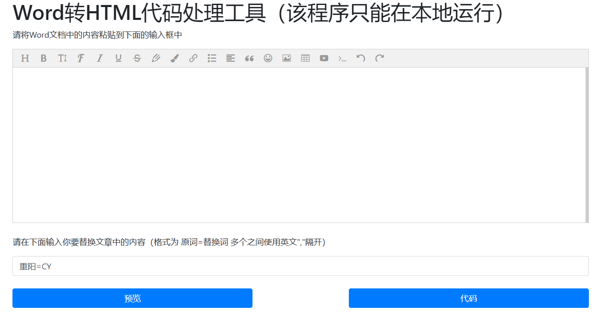
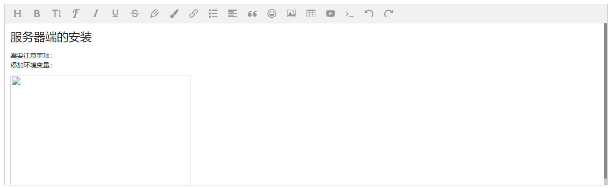

# Word转HTML代码处理工具

该项目是解决博客系统想要导入Word文档中的数据内容所创建的，该项目只能在本地运行

## 工具预览

运行后的界面如下：

## 工具背景

在博客系统中，如果涉及到DOC文档，假设在博客系统中使用后台处理DOC文档的方式，那么会造成格式不可控，图片存放困难，最重要的是需要处理Word文档就需要导入POI或者其他工具导致博客项目的体积无形的增大

但是如果说用富文本编辑器来保留DOC文档的格式的话，那么会产生一种情况，图片无法正确显示，例如:

那么就需要将这些图片处理到HTML页面上，工具的主要作用就是如此，当然该工具还进行了图片大小的调整（设置了`style="max-width: 100%;"`），也可以替换文档中的敏感词，需要自己规定（用法见页面）!

后续可能会配合博客项目支持更多方便的功能，例如图片一键上传到七牛云等。

## 工具原理

1、复制文件中的文本到富文本编辑器中，保留格式，此时图片无法显示  
2、提交文本框中的数据到后台，后台将图片中地址解析，然后生成Base64嵌入到页面中去  
3、然后返回前台一个JSON，JSON中是处理后的HTML代码，包含了Base64处理后的图片  

注意：将转换好的代码复制到其他富文本编辑器的时候一定要注意后台处理script脚本，解决脚本注入问题